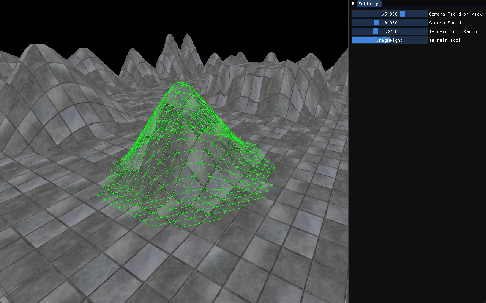
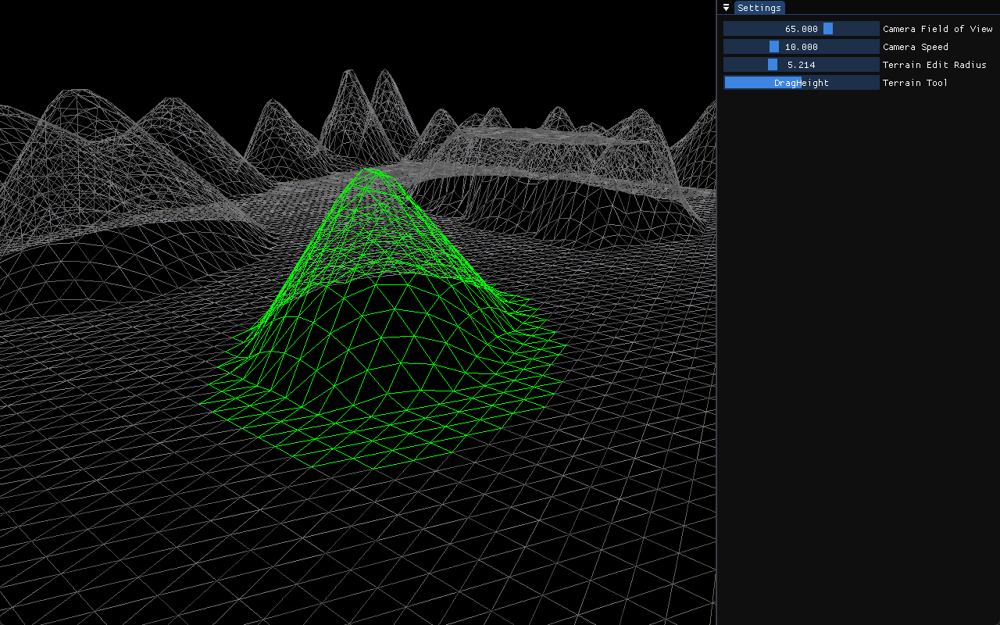

# iolite

**iolite** is a simple and lightweight 3D game engine written in C++ with OpenGL. It includes a basic terrain editor, allowing you to create and modify 3D landscapes.  

## Features

- 3D rendering with OpenGL
- Terrain editor
- Flying Camera
- Loading model files (obj), textures (png, jpg), shaders (glsl)
- Modular and extendable design

This project is a work in progress.  





---

# Installation Guide

Follow the steps below to clone, build, and run the game engine project using Visual Studio with CMake support.

---

## Prerequisites

1. **Visual Studio 2022**  
   Ensure you have Visual Studio 2022 installed. During installation, select the following components:  
   - Desktop development with C++  
   - CMake tools for Windows  

2. **Git**  
   Ensure you have Git installed to clone the repository.

---

## Installation and Setup

1. **Clone the Repository**  
   Open a terminal or command prompt and run the following command to clone the repository:  
   ```bash
   git clone https://github.com/knsdev/iolite.git
   ```

2. **Run Build Script**  
   Navigate to the cloned repository's root folder and execute the build script:  
   ```bash
   build_windows.bat
   ```
   Note: If you are using a version of Visual Studio other than 2022, modify the -G argument in the script to specify your version.

3. **Open the Solution File**  
   Navigate to the build folder and open the iolite.sln file in Visual Studio:  
   ```bash
   build/iolite.sln
   ```

4. **Set Startup Project**  
In Visual Studio, set the game project as the startup project:  
    1. Right-click on the game project in the Solution Explorer.  
    2. Click Set as Startup Project.  

5. **Build and Run**  
   Press F5 in Visual Studio to build and run the game application.  

---

## Controls

- **Camera Controls**
    - **Rotation**: Hold the Right Mouse Button and move the mouse
    - **Directional Movement**: WASD
    - **Move Up**: Space
    - **Move Down**: Shift

- **Terrain Controls**
    - Set the Terrain Tool to **DragHeight** in the Settings window. Hold the Left Mouse Button and move the mouse up/down to adjust the terrain height.
    - Set the Terrain Tool to **Flatten** in the Settings window. Hold the Left Mouse Button and move the mouse over the terrain to flatten it.

- **Toggle Wireframe Mode**
    - Press **Tab** to toggle wireframe mode

